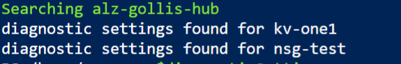
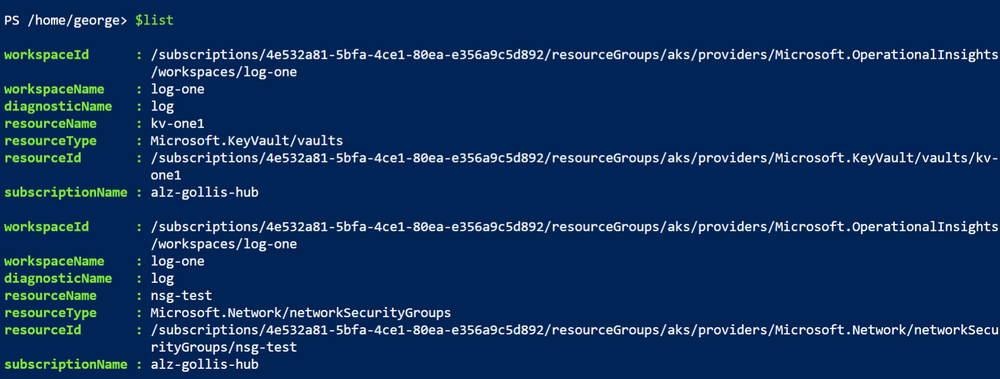
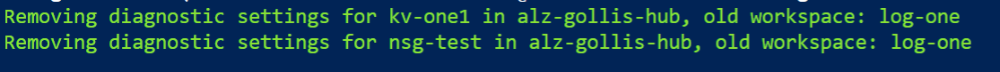

Sometimes you may have a requirement to view all the diagnostic settings for your resources and where they are sending them. You may also have a requirement to remove these at scale. Firstly you will need to open PowerShell, this can be done through the Cloud Shell which already has the required modules installed. 

The first set of commands to run will create two variables called $list and $subscriptions.

- $list will create an empty list that we will use in the script.
- $subscriptions will return all the subscriptions we will be looping over.

    $list = New-Object System.Collections.Generic.List[System.Object]
    $subscriptions = Get-AzSubscription

Once complete run the main script. The script will loop over all resources detected and if they can find a diagnostic setting that is reporting to a workspace it will create a hashtable and add that to the empty list, once complete it will return all the resources that have diagnostic settings reporting to a workspace. 

    Foreach ($sub in $subscriptions) {
        Write-Host "Searching $($sub.name)" -ForegroundColor Green
        Select-AzSubscription -Subscription $sub.Name | Out-Null
        $resources = Get-AzResource
        foreach ($res in $Resources) {
    
            $resId = $res.ResourceId
            $diagnosticSetting = Get-AzDiagnosticSetting -ResourceId $resId -WarningAction SilentlyContinue -ErrorAction SilentlyContinue
            
            If ($diagnosticSetting.WorkspaceId -ne $null) {
                Write-Host "diagnostic settings found for $($res.name)"
                $resourceDiagnostic = [PSCustomObject]@{ 
                    "workspaceId"      = $diagnosticSetting.WorkspaceId
                    "workspaceName"    = ($diagnosticSetting.WorkspaceId).Split("/")[8]
                    "diagnosticName"   = $diagnosticSetting.Name
                    "resourceName"     = $res.Name
                    "resourceType"     = $res.ResourceType
                    "resourceId"       = $res.ResourceId
                    "subscriptionName" = $sub.Name
                }
                
                $list.Add($resourceDiagnostic)
            }
        }
    }

As the script can take a long time as you could have thousands of resources, the script will continue to update you by writing output to the screen.

Once complete, you will now have a table that can be returned through the $list variable. The properties that are returned can be found below:

You can now view all the diagnostic settings for resources reporting to a workspace, sometimes you may need to delete diagnostic settings if they are reporting to an incorrect workspace or you may just want to view all the diagnostic settings. In our example, we will continue by now removing these diagnostic settings as they are reporting to an incorrect workspace. I will do this by using the $list variable and using a where-object pipe to search for diagnostic settings reporting to the workspace "log-one". In this example, the "log-one" workspace is incorrect and I would like to remove these. 

I will create a new variable called filter, which will be used to store all the diagnostic settings that I want to remove. 

    $filter = $list | where { $_.workspaceName -eq "incorrect-workspace" }

Finally, we can remove the diagnostic settings for these resources by running the following command. This command will use the $filter variable and will group all resources by the subscription, it will then loop over them and remove the diagnostic settings. 

    $filter | Group-Object -p subscriptionName | 
    foreach { 
        Select-AzSubscription $_.Name ; ForEach-Object { $azDiagNosticSetting = ($_.group) ; $azDiagNosticSetting | 
            foreach { Remove-AzDiagnosticSetting -ResourceId $_.resourceId -Name $_.diagnosticName ; 
                write-host "Removing diagnostic settings for $($_.resourceName) in $($_.subscriptionName), old workspace: $($_.workspaceName)" -f green } } }

Thanks for reading! If this article was useful, please just let me know. :) 
